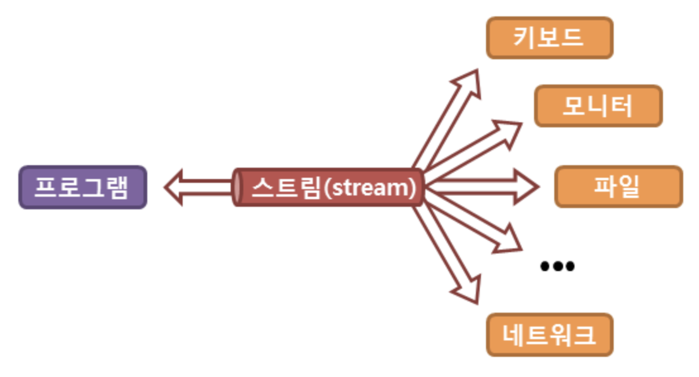
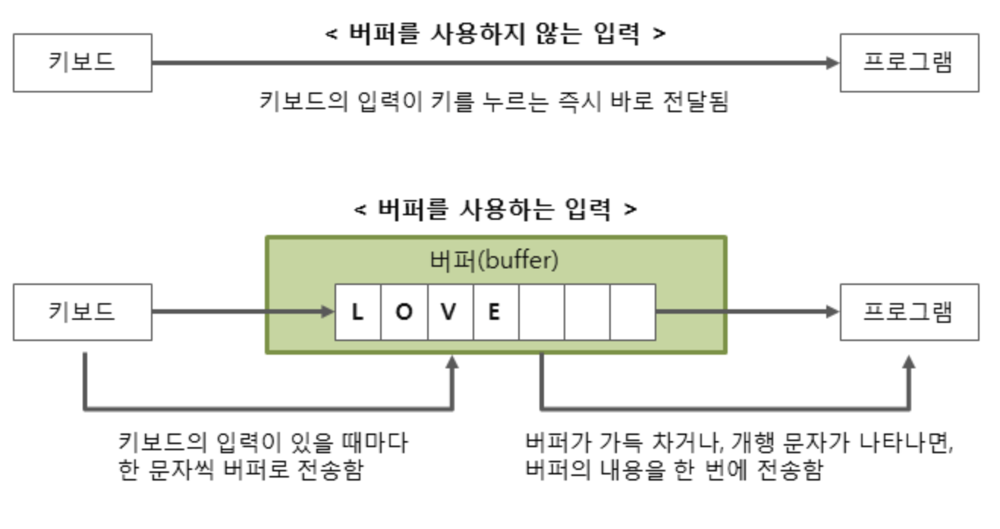

# CPP_Module_00

## Exercise 00: Megaphone

***학습 포인트***
- c++ 출력하기


### 스트림(stream)

C++ 프로그램은 파일이나 콘솔의 입출력을 직접 다루지 않고, 

스트림(stream)이라는 흐름을 통해 다룬다

스트림(stream)이란 실제의 입력이나 출력이 표현된 데이터의 이상화된 흐름을 의미한다

즉, 스트림은 운영체제에 의해 생성되는 가상의 연결 고리를 의미하며,

`중간 매개자` 역할을 한다



[출처-TCPSCHOOL](http://www.tcpschool.com/cpp/cpp_io_streamBuffer)

### 버퍼(buffer)

스트림은 내부에 버퍼(buffer)라는 임시 메모리 공간을 가지고 있다

이러한 버퍼를 이용하면 입력과 출력을 좀 더 효율적으로 처리할 수 있게 된다

1. 문자를 하나씩 전달하는 것이 아닌 묶어서 한 번에 전달하므로, 전송 시간이 적게 걸려 성능이 향상
2. 사용자가 문자를 잘못 입력했을 경우 수정이 가능


[출처-TCPSCHOOL](http://www.tcpschool.com/cpp/cpp_io_streamBuffer)

반드시 버퍼가 좋은것은 아니다

빠른 반응이 요구되는 게임과 같은 프로그램에서는 키를 누르는 즉시 바로 전달되어야 한다

따라서 자신의 목적에 맞게 버퍼의 사용 여부를 판단해야 한다

대부분의 C++ 프로그램은

입력 시에는 사용자가 Enter 키를 누르면 입력 버퍼를 비우고,

출력 시에는 개행 문자를 전달받으면 출력 버퍼를 비우게 된다

### iostream
```c
#include <iostream>
```
사용자가 프로그램과 대화하기 위해서는 사용자와 프로그램 사이의 입출력을 담당하는 `수단이 필요`하다

C++의 모든 것은 `객체로 표현`되므로, 

입출력을 담당하는 수단 또한 C언어의 함수와는 달리 모두 객체이다

C언어의 printf() 함수나 scanf() 함수처럼

C++에서는 cout 객체로 출력 작업을, cin 객체로 입력 작업을 수행하고 있다

또한, C++에서는 기존의 C언어 스타일처럼 printf() 함수나 scanf() 함수로도 입출력 작업을 수행할 수 있다

### 출력 스트림 cout

```cpp
#include <iostream>

std::cout << 출력할 데이터;

> 출력할 데이터
```

C++에서 미리 정의된 출력 스트림을 나타내는 객체

삽입 연산자(<<)는 오른쪽에 위치한 출력할 데이터를 출력 스트림에 삽입

출력 스트림에 삽입된 데이터는 스트림을 통해 출력 장치로 전달되어 출력

### 입력 스트림 cin

```cpp
#include <iostream>

std::cin >> 저장할 변수;
```

C++에서 미리 정의된 입력 스트림을 나타내는 객체

추출 연산자(>>)를 통해 사용자가 입력한 데이터를 입력 스트림에서 추출하여, 오른쪽에 위치한 변수에 저장

이때 cin 객체는 자동으로 사용자가 입력한 데이터를 오른쪽에 위치한 변수의 타입과 `동일하게 변환`

- C언어 표준 입출력 함수와의 차이점

    C언어 표준 입출력 함수인 printf() 함수나 scanf() 함수와 C++ 표준 입출력 객체와의 차이점

  1. 삽입 연산자(<<)와 추출 연산자(>>)가 데이터의 흐름을 나타내므로 좀 더 직관적
  2. C++ 표준 입출력 객체는 입출력 데이터의 타입을 자동으로 변환시켜주므로 더욱 편리하고 안전

### istream

istream은 실제로 입력을 수행하는데,

operator`>>`가 istream 클래스에 정의된 연산자이다

또한 `cin`은 istream 클래스의 객체 중 하나이다

cin은 엔터나 공백을 입력 시에 무시한다


`ios 클래스`에서 스트림의 상태를 `관리`하는데,

이때 사용하는 `flag(1 bit)`은 4가지가 있다.

- `goodbit` : 스트림에 입출력 작업이 가능할 때

- `badbit` : 스트림에 복구 불가능한 오류 발생시

- `failbit` : 스트림에 복구 가능한 오류 발생시

    타입에 맞지 않는 값을 넣어서 오류가 발생하는 경우는 failbit가 켜진다
- `eofbit` : 입력 작업시에 EOF 도달시


```cpp
int t;
while(std::cin >> t) {
    std::cout << "입력 :: " << t << std::endl;
    if (t == 0) break;
}
```

t에 c를 입력할 경우 `failbit`가 켜진다

ios에는 `operator void*() const;` 함수가 존재하는데,

이 함수는 `ios 객체`를 `void*`로 변환해 준다

NULL 포인터(0)가 아닌 값을 리턴하는 조건이, `failbit와 badbit가 모두 off일 때`이다 

만약 while 문에서 c 를 입력한다면 

operator`>>` 는 cin 객체의 failbit를 켜게 되고,

`ios 객체 -> void* -> bool`로 가는 변환을 통해 while문을 빠져나올 수 있다

(NULL 포인터는 bool상 false이다)

하지만 이미 failbit가 켜진 상태이므로, 더 이상 cin을 통한 입력을 진행할수가 없다

플래그를 초기화 해야한다

```cpp
int t;
while(true) {
    std::cin >> t;
    std::cout << "입력 :: " << t << std::endl;
    if (std::cin.fail()) {
        std::cin.clear();
        // 플래그들 초기화
        std::cin.ignore(100, '\n');
        // 개행문자가 나올때까지 무시
    }

    if (t == 1) break;
}
```

문자열 스트림의 현재상태 확인하기

`std::ios` 가장 높은 조상 입출력 클래스이다

good(), eof(), fail(), bad() 함수를 통해서 현재 파일 스트림의 상태를 체크해볼 수 있는데

- stream.good()

std::ios::good

스트림의 현재 상태가 좋으면 true, 안좋으면 false 리턴

good은 이 세가지 비트 플래그가 모두 true일때 true를 반환하고 하나라도 false이면 false를 반환하게 된다

다시말해, 모든 error state flag가 0일 때 flag가 true가 된다

eof,fail,bad는 비트 플래그로 되어 있다

- stream.eof()

std::ios::eof

eof 즉 `end of file` 에 도달했다면 true 리턴 아니면 false 리턴

파일을 끝까지 다 읽었는지 확인한다

- stream.fail()

std::ios::fail

스트림 현재 상태가 실패면 true 성공이면 false 리턴

good()의 반대

error state `flag가 하나라도 1`일 경우 flag가 `true`가 된다

`fail 플래그`는 `논리 오류가 발생했을때` 설정이 된다

예를 들면 받고자 하는 값은 int형인데 문자형을 받았을 경우 failbit이 설정된다

failbit이 설정되더라도 입출력이 가능하지만 badbit이 발생한다면 입출력이 불가능해진다

- stream.bad()

std::ios::bad

데이터를 `읽거나 쓸 때 에러가 발생`할 때 flag가 `true`가 된다

`bad 플래그`는 스트림의 완전성이 깨질 경우에 true가 되는데

하나의 스트림에 `동시의 두개의 다른 작업이 진행 될 때` 발생하는 것이다

- good : 스트림의 상태가 입출력 작업을 할 수 있는지 확인한다
- eof : eof 비트가 설정되었는지 확인한다
- bad : bad 비트가 설정되었는지 확인한다
- fail : fail 비트나 bad 비트가 설정되었는지 확인한다

`clear()` 는 플래그를 goodbit으로 초기화시키고,

`ignore(100, '\n')`는 최대 첫번째 인자 만큼 (100), 두 번째 인자가 나올 때까지 ('\n'), 버퍼에서 무시한다

```cpp
#include <iostream>
#include <string>

using namespace std;

void printStates(const std::ios& stream)
{
	cout << std::boolalpha;		// boolalpha option ON
	cout << "Good() = " << stream.good() << '\n';	// 모든 error state flag가 0일 때 flag가 true가 된다.
	cout << "eof() = " << stream.eof() << '\n';		// stream의 end of file에 도달하면 flag가 true가 된다.
	cout << "fail() = " << stream.fail() << '\n';	// error state flag가 하나라도 1일 경우 flag가 true가 된다.
	cout << "bad() = " << stream.bad() << '\n';		// 데이터를 읽거나 쓸 때 에러가 발생할 때 flag가 true가 된다.
}

int main()
{
	while(true)
	{
	    int i;
	    cin >> i;
	    
	    printStates(cin);
	    
	    cin.clear();
	    cin.ignore(1024, '\n');
	    cout << endl;
	}

	return 0;
}
```

```vim
💎입력💎
123
abc
123.456

💎출력💎
good() = true
eof() = false
fail() = false
bad() = false

good() = false
eof() = false
fail() = true
bad() = false

good() = true
eof() = false
fail() = false
bad() = false
```
- printStates(cin)

cin 스트림을 넘겨 줌

iostream의 부모클래스인 ios 타입의 참조 변수로 cin 객체를 참조

123 입력

int i 에 123이 잘 들어갔다

good() = true. 이상 없음

버퍼가 비워지고 이제 다시 while 반복

abc 입력

abc는 문자열이므로 int i에 들어갈 수 없다


논리적 오류 fail() = true

good() = false

버퍼가 지워지고 이제 다시 while 반복

123.456 입력

123.456은 double형인데 int i에 123으로 들어갈 수 있음

good() = true 이상 없음

버퍼가 지워지고 이제 다시 while 반복

...


[출처-흐름 상태와 입력 유효성의 검증](https://ansohxxn.github.io/cpp/chapter18-4/)

### 대문자로 변환

```c
std::toupper()
// char 한글자만 변경이 가능

// str 전체를 한번에 바꾸고 싶다면?
std::transform(str.begin(), str.end(), str.begin(), ::toupper);
/*1*/ 입력한 변수의 first 위치, 
/*2*/ 입력한 변수의 last 위치까지, 
/*3*/ 저장할 변수의 first 위치, 
/*4*/ 변환할 방법이 있는 함수
```

### 개행 출력

```cpp
std::endl
// == "\n"
```

-----

## Exercise 01: My Awesome PhoneBook

***학습 포인트***

- 두개의 class 생성하기
- 클래스의 인스턴스로 인스턴스화
- private, public

### this pointer

```c
this
```

객체 지향 프로그래밍에서 클래스의 멤버 함수를 호출할 때

C++는 어떻게 호출할 객체(인스턴스)를 찾는가?

-> this라는 숨겨진 포인터를 사용한다

this 포인터는 모든 멤버 함수에 추가되는 숨겨진 매개 변수다

호출된 객체의 주소를 가리키는 상수 포인터다

```cpp
void SetID(int id)
{
    m_ID = id;
}

simple.SetID(2);
```

멤버 함수는 하나의 인자를 받는 것 같지만 사실은

```cpp
void SetID(Simple* const this, int id) // 이렇게 함수 정의가 변환된다.
{
    this->m_ID = id;
}

simple.SetID(&simple, 2); 
```

컴파일러에 의해 다음과 같이 변환된다

이 this 포인터는 멤버 함수가 호출된 객체의 주소를 가리키는 숨겨진 포인터다

모든 멤버 함수는 함수가 호출된 객체(인스턴스)를 가리키는 this 포인터를 가지고 있다

```cpp
    Simple A(1); 
    // =Simple A(&A, 1); -> Simple 클래스의 생성자 내부에서: this = &A    
    Simple B(2); 
    // =Simple B(&B, 2); -> Simple 클래스의 생성자 내부에서: this = &B  
    A.SetID(3);  
    // =A.SetID(&A, 3);  -> 멤버 함수 SetID 내부에서: this = &A 
    B.SetID(4);  
    // =B.SetID(&B, 4);  -> 멤버 함수 SetID 내부에서: this = &B 
```

- 명시적으로 this를 참조해야 하는 경우

멤버 변수와 이름이 같은 매개 변수를 가진 생성자(또는 멤버 함수)가 있는 경우: this를 사용해서 구분할 수 있다

```cpp
class Something
{
private:
    int data;

public:
    Something(int data)
    {
        this->data = data;
        // this->data는 멤버 변수이고,
        // data는 매개 변수
    }
};
```

this-> 를 명시적으로 사용해서 구분할 수 있지만,

멤버 변수 이름에 m_과 같은 접두사를 이용해서 이름 중복을 방지하는 게 좀 더 바람직하다

- 멤버 함수 체이닝 기법

클래스 멤버 함수가 작업 중이던 객체(인스턴스)를 반환하는 방식이 유용할 때가 있다

```cpp
class Calc
{
private:
    int m_Value = 0;

public:
    void Add(int value) { m_Value += value;}
    void Sub(int value) { m_Value -= value;}
    void Mul(int value) { m_Value *= value;}

    int GetValue() { return m_Value; }
}

int main()
{
    Calc calc;

    calc.Add(5); // return void
    calc.Sub(3); // return void
    calc.Mul(4); // return void

    cout << calc.GetValue() << endl; // 8
    return 0;
}
```

만약 각각의 멤버 함수가 this를 반환한다면 체이닝 기능을 구현한다면

```cpp
class Calc
{
private:
    int m_Value = 0;

public:
    Calc& Add(int value) { m_Value += value; return *this; }
    Calc& Sub(int value) { m_Value -= value; return *this; }
    Calc& Mul(int value) { m_Value *= value; return *this; }

    int GetValue() { return m_Value; }
}

int main()
{
    Calc calc;

    calc.Add(5).Sub(3).Mul(4);

    cout << calc.GetValue() << endl; // 8
    return 0;
}
```

코드 3줄을 단 1줄로 바꿀 수 있다

*this를 반환하는 방식으로 함수 체이닝 기법을 만들 수 있다


### 생성자(Constructor)

```c
PhoneBook phoneBook;

PhoneBook phoneBook = PhoneBook();
```
- 객체 생성시에 호출
- 오버로딩 가능
    ```c
    class 클래스명 {
    public:
        클래스명(매개변수..){
            // ...
        }
            // ..
    }

    int main(){

        클래스명 변수;

        클래스명 변수(); // Error

        클래스명 변수 = 클래스명();

        클래스명 변수(10);

        클래스명 변수(30, "string");
    }
    ```

### cin의 한계 -> getline()

```c
std::cin >> value1;
std::cin >> value2;

> value1 input : hello world
> value1 result : hello
> value2 result : world
// 공백을 기준으로 버퍼에 담긴 값이 그대로 전달된다
// 공백까지 입력가능한 함수 getline();
istream& getline (istream& is, string& str)
```
띄어쓰기를 포함해 입력받을 수 있다

- istream& is : 표준입력을 수행하는 클래스
- string& str : 입력받을 string 변수

엔터로 입력을 구분한다

### 

```c
string.substr(s, e);
```


### 출력 자릿수 지정

```c
std::setw();

int num = 123;

std::cout << setw(10) << num;

> '       123'
```

- 필드 폭의 자릿수를 지정할 수 있음
- 오른쪽 정렬로 출력


### 

```c
std::atoi(string.c_str());
```

`int atoi (const char * str)`

헤더파일(CPP) : \<cstdlib\>

설명 : C style의 문자열을 입력받아서 int (숫자) 타입으로 변환하여 리턴한다

`std::string c_str()`

반환형이 `char *` 이므로,

해당하는 string의 첫번재 문자의 주소값(포인터)를 반환한다

```cpp
char* --> string 
// C style의 char * 형을 C++ style의 string 으로 변환
char * cStr = "Cstring";
string cppStr = cStr;
 
cout << "[test1] : char * --> string " << endl;
cout << "==> cppStr : " << cppStr << endl << endl;


string --> char *
// C++의 string을 C style의 char * 형으로 변환
string cppStr = "CPPstring";
const char * cStr2 = cppStr.c_str();
 
cout << "[test2] : string --> char *" << endl;
printf("==> printf > cStr2 : %s\n", cStr2);
cout << "==> cout > cStr2 : " << cStr2 << endl << endl;

char * --> int
// C style의 char * 를 int 타입으로 변환
char * cStr = "20170711";
int num = atoi(cStr);
 
printf("printf : %d\n", ++num);  //증가 후 출력
cout <<"cout : "<< ++num << endl;//증가 후 출력

string --> char * --> int
// C++의 string을 int 타입으로 한번에 변환
string s = "2017";
int num = atoi(s.c_str());
 
printf("printf : %d\n", ++num);     //증가 후 출력
cout << "cout : " << ++num << endl; //증가 후 출력

```

### 문자열의 길이를 확인

```c
string.size();
// 문자열의 바이트 수를 반환
// 빈 문자열의 크기는 0

string.length();
// 문자열의 길이를 바이트 단위로 반환
// size()와 같음
```

### 문자열이 비어있는지 확인
```c
string.empty();
```
- 비어있으면 true(1)
- 비어있지 않으면 false(0)
