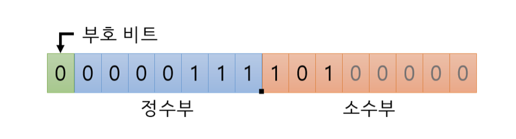

# CPP_Module_02

_New rules_

From now on, all your classes must be designed in the `Orthodox Canonical Form`, unless explicitely stated otherwise. Then, they will implement the four required member functions below:

canonical이란, "규정대로"하는 프로그래밍을 의미하며,

말그대로 클래스를 사용할때 Orthodox canonical 규칙들을 따르는것이다.

- 디폴트 생성자(Default constructor)
- 복사 생성자(Copy constructor)
- 할당 연산자 오버로딩(Copy assignment operator)
- 소멸자(Destructor)

### 디폴트 생성자

어떠한 생성자도 정의되지 않았을 때 생성된다

```cpp
class a {
    a(){};
}
```

### 복사 생성자

다른 객체의 값을 복사해서 초기화하는데 사용하는 생성자이다

```cpp
T(const T& a);
```
다른 T 의 객체 a 를 상수 레퍼런스로 받는다

a 가 const 이기 때문에 복사 생성자 내부에서 a 의 데이터를 `변경할 수 없고`, 

오직 새롭게 초기화 되는 인스턴스 변수들에게 `복사` 만 할 수 있다

```cpp
Photon_Cannon::Photon_Cannon(const Photon_Cannon& pc) {

  std::cout << "복사 생성자 호출 !" << std::endl;
  hp = pc.hp;
  shield = pc.shield;
  coord_x = pc.coord_x;
  coord_y = pc.coord_y;
  damage = pc.damage;

}

int main() {
    Photon_Cannon pc1(3, 3);
    Photon_Cannon pc2(pc1);


    //아래의 예시는 서로 다르다
    Photon_Cannon pc3 = pc2; // 복사 생성자( 는 오직 생성 시에 호출된다 )

    Photon_Cannon pc3;      // 기본 생성자
    pc3 = pc2;
}
```

굳이 명시하지 않아도 사실은 디폴트 생성자처럼 디폴트 복사 생성자도 지원한다

생성자에 `new` 를 통한 `동적 할당 초기화` 가 있을 경우,

기본 복사 생성자는 한계를 가진다

만약 매개변수로 받은 이름을 동적할당하여 클래스의 멤버변수에 초기화한다면

복사 생성자의 경우 단순히 `name = ref.name` 로 전달되므로

하나의 메모리를 두 클래스가 공유하게 된다

이런 경우 메모리가 하나임에도 불구하고 소멸자가 호출되면서 delect 될 때

클래스가 두 개이므로 두번의 delect가 호출되면서 오류가 발생한다

따라서 이를 고려한 `얕은 복사`, `깊은 복사` 개념을 알아야 한다

- 얕은 복사( Shallow Copy )
    객체를 복사할 때 `해당 객체만 복사(대입)`하여 새 객체를 생성

    복사된 객체의 인스턴스 변수는 `원본 객체의 인스턴스 변수와 같은 메모리 주소를 참조`

    해당 메모리 주소의 값이 변경되면 원본 객체, 복사 객체의 인스턴스 변수 `값이 함께 변경`됨

- 깊은 복사( Deep Copy )

    객체를 복사할 때 해당 객체와 인스턴스 변수까지 모두 복사

    전부를 복사하여 `새 객체에 담음`

    `참조를 공유하지 않으며`, 기존의 복사한 인스턴스와 `다른 메모리 공간에 할당`되어 독립적

```cpp
int main (){
	int *a = new int(5);
    int *b = new int(3);
    
    a = b; //얕은 복사(참조만 복사)
    *a = *b; // 깊은 복사(값을 복사)
}
```

### 할당연산자 오버로딩

오버로딩(overloading) 한다 == 기본 연산자들을 직접 사용자가 정의하는 것

```cpp
( 리턴 타입 ) operator( 연산자 ) ( 연산자가 받는 인자 )
```

- 대입 연산자 함수

```cpp
Complex& operator=(const Complex& c);
```

대입 연산자 함수는 자기 자신을 가리키는 레퍼런스를 리턴한다

그 이유는

```cpp
a = b = c;
```

에서 b = c;는 b를 리턴해야하기 때문이다

이 때 Complex 타입을 리턴하지 않고 굳이 Complex& 타입을 리턴하냐면, 

대입 연산 이후에 불필요한 복사를 방지하기 위해서다

```cpp
Complex& Complex::operator=(const Complex& c)

{
  real = c.real;
  img = c.img;
  return *this;
}
```

- 기본 = 연산자

대입 연산자도 기본적으로 지원한다

복사 생성자를 다룰 때 디폴트 복사 생성자가 있었던 것과 일맥상통

```cpp
    int main(){
	test s1("hi");
   	test s2;
    
    s2 = s1; // 주소가 전달

    //아래의 예시는 서로 다르다
    Some_Class a = b;  // ① a 의 '복사 생성자' 가 호출

    Some_Class a;  // ② 기본 생성자가 호출 된 후 
    a = b;         // 대입 연산자 함수가 실행
}
```

선언 후 대입, 기본적으로 `얕은 복사`가 일어난다

- 할당 연산자 오버로드

```cpp
class test{
	test& operator=(const test &s1){
    	strData = s1.strdata;
        len = s1.len;
        return *this;
    }
}
```


## Exercise 00: My First Class in Orthodox Canonical Form 

***학습 포인트***
- 기본 생성자, 복사 생성자, 대입 연산자, 각각의 멤버 함수들, 소멸자 개념에 대한 이해

***요구 사항 정리***
C++은 고정소수점을 갖고 있지 않으므로, 직접 만들어 보자.

Canonical Form 지켜라

Fixed 라는 클래스를 정의하라

멤버 변수/멤버 함수들은 다음과 같다

- private members
    fixed point 값이 저장될 정수형 변수
    항상 8의 값을 가지는 fractional bits가 저장될 static 정수형 상수.

- public members
    fixed point 값을 0으로 초기화시키는 기본 생상자

    소멸자

    복사 생성자

    대입 연산자 오버로딩 (assignation operator overload)

    getRawBits : raq value값을 단순히 반환하는 함수 (const)

    setRawBits : raw value값을 변경하는 함수

주어진 main 문을 컴파일했을 때 동일한 결과가 나오도록 구현하라

---

### Fixed point numbers 고정소수점 

컴퓨터에서 실수를 표현하는 방식으로 `고정소수점`과 `부동소수점`이 있다

컴퓨터가 수를 어떻게 표현하는가?

컴퓨터는 0과 1로 이루어진 기계어를 사용하고 인간이 사용하는 10진수를 2진수로 바꿔 저장한다는 사실을 알고 있다

즉 10진수 정수를 2진수로 바꾸어 저장한다

그렇다면 `실수`, 즉 소수점이 붙어있는 수는 어떻게 `2진수로 변환`할까?

정수부는 정수 변환하는 방법과 동일하다

소수부가 문제인데, 정수 변환과 동일한 방법으로 변환하면 서로 다른 10진수 숫자가 2진수로 변환되었을 때 이와 중복될 수 있다

1.9 -> 1.1001
1.41 -> 1.100 1

정수부 변환의 정반대로 진행된다

정수부에서는 10진수를 2로 나눠가면서 1이나 0을 뽑았다면

소수부는 10진수에 2를 곱해가면서 1이나 0을 뽑아낸다

정수부 변환때는 1이 나오면 종료했다면 

소수부는 0이 나오면 종료하고 결과를 밑에서부터가 아니라 위에서부터 읽어준다

```vim
# 0.625 이진수 변환

0.625 * 2 = 1.25 -> 1을 빼내고 나머지 0.25
0.25 * 2 = 0.5 -> 0을 빼내고 나머지 0.5
0.5 * 2 = 1.0 -> 1을 빼내고 나머지 0

0.625 -> 0.101
```

0이 나왔으니 변환을 종료하고 빼낸 숫자들을 위에서부터 읽어주면 된다

- `고정소수점`

위에서 설명한 방법대로 10진수를 2진수로 바꿨으면, 그걸 그대로 넣는 방식이다

7.625라는 숫자를 2진수로 변환하면 111.101 이다

이를 메모리에 저장할때를 생각해보자



16비트 체계를 쓴다고 가정했을 떄,

맨 앞 1자리는 부호 비트 ( Sign Bit ) 라고 해서 `0이면 양수`, `1이면 음수`라는 뜻이다

나머지 비트들은 소수점을 기준으로 정수부랑 소수부를 표현하는 비트로 각각 나누게 되는데,

소수점의 위치는 미리 정해둔다

소수부의 경우 앞에서부터 채우며 남는 뒷자리는 다 0으로 채운다

이러한 고정소수점 방식은 구현하기 편리하지만 

사용하는 비트 수 대비 표현 가능한 수의 범위 또는 정밀도가 낮기 때문에 

실수를 다룰 필요가 있는 범용 시스템에서는 거의 안 쓰이고, 

높은 정밀도가 필요없는 소규모 시스템에서는 간혹 쓰이기도 한다고 한다

- `부동소수점`

부동소수점 표현 방식은 그대로 넣지 않고 몇가지 과정을 추가한다

정수부에 1만 남을 때까지 소수점을 왼쪽( 정수부가 0일 경우엔 오른쪽 )으로 이동시키고 

이동한 칸 수만큼 n 자리에 집어넣으면 된다

예를 들어  111.101을 정규화하면 1.11101 * 2^2 가 된다

부동 이라는 말이 마치 움직이지 않는다는 뜻 같지만

부동은 소수점을 `이동` 시킨다는데에서 floating point 라는 용어가 나온 것 같다

[출처: 컴퓨터에서의 실수 표현: 고정소수점 vs 부동소수점](https://gsmesie692.tistory.com/94)

## Exercise 01: Towards a more useful fixed-point number class

***학습 포인트***
- 기본 생성자, 복사 생성자, 대입 연산자, 각각의 멤버 함수들, 소멸자 개념에 대한 이해

***요구 사항 정리***

임의의 정수를 고정소수점으로 변환할 때는 2가지 방법

1.비트 쉬프트: num << _bits
정수 num을 소수점 bit만큼 왼쪽으로 옮겨서 저장해놓는다.

2^_bits 곱하기: num * 2^_bits
소수점 bit만큼 비트를 옮겼다는 건 결국 그 정수가 2^_bits만큼 커졌다는 걸 의미한다. 따라서 그만큼 곱해주면 된다.
- 과제에서는 소수점 bit로 8이 주어졌으니 8비트만큼 왼쪽으로 밀거나, 2^8 = 256만큼 곱해서 저장하면 된다
